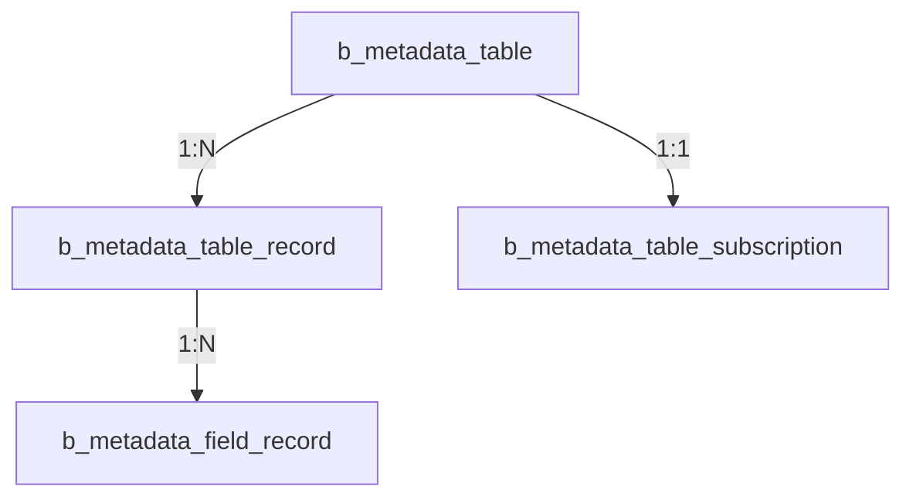

# spring-boot-learn
spring,spring-boot等学习demo

## 元数据表字段相关

```mermaid
graph TB
b_metadata_table[b_metadata_table]-->|1:N|b_metadata_table_record[b_metadata_table_record]
b_metadata_table[b_metadata_table]-->|1:1|b_metadata_table_subscription[b_metadata_table_subscription]
b_metadata_table_record[b_metadata_table_record]-->|1:N|b_metadata_field_record[b_metadata_field_record]
```
