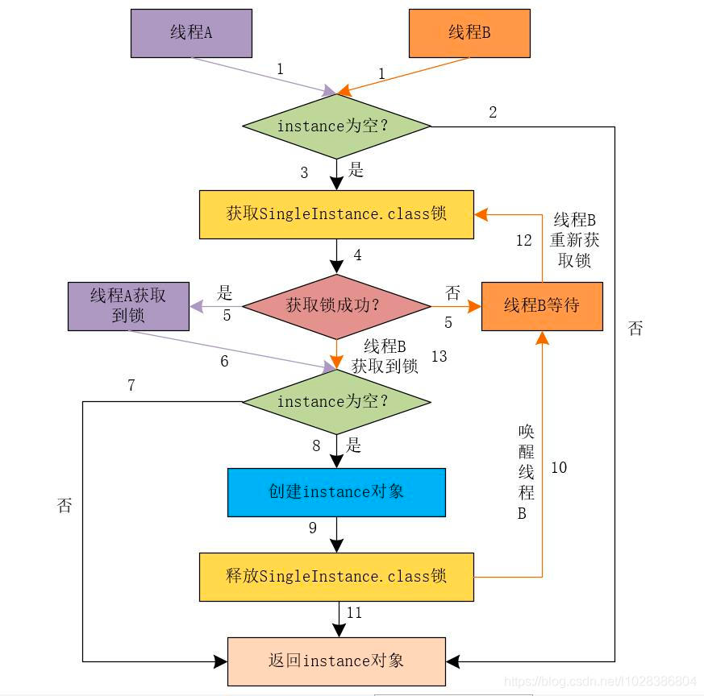
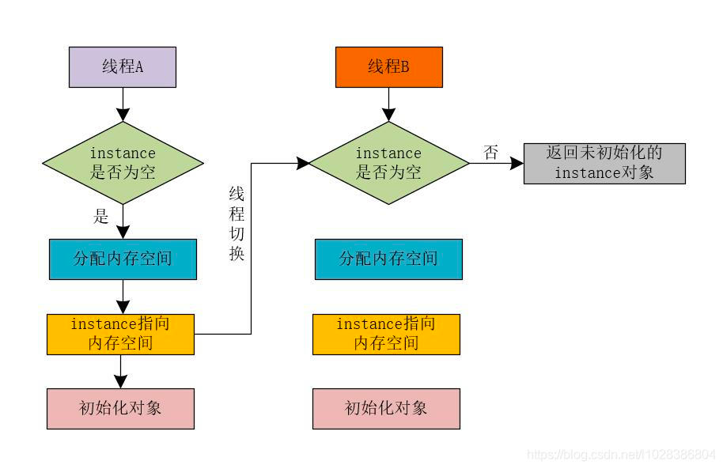

CPU 增加了缓存，以均衡与内存的速度差异；// 导致 可见性问题 
操作系统增加了进程、线程，以分时复用 CPU，进而均衡 CPU 与 I/O 设备的速度差异；线程切换 // 导致 原子性问题 
编译程序优化指令执行次序，使得缓存能够得到更加合理地利用。// 导致 有序性问题

###可见性: CPU缓存引起
可见性：一个线程对共享变量的修改，另外一个线程能够立刻看到。

举个简单的例子，看下面这段代码：
```
//线程1执行的代码
int i = 0;
i = 10;
//线程2执行的代码
j = i;
```
假若执行线程1的是CPU1，执行线程2的是CPU2。由上面的分析可知，当线程1执行 i =10这句时，会先把i的初始值加载到CPU1的高速缓存中，然后赋值为10，那么在CPU1的高速缓存当中i的值变为10了，却没有立即写入到主存当中。 
此时线程2执行 j = i，它会先去主存读取i的值并加载到CPU2的缓存当中，注意此时内存当中i的值还是0，那么就会使得j的值为0，而不是10. 
这就是可见性问题，线程1对变量i修改了之后，线程2没有立即看到线程1修改的值。


###原子性: 分时复用引起 
原子性：即一个操作或者多个操作 要么全部执行并且执行的过程不会被任何因素打断，要么就都不执行。
一个非常经典的案例就是银行卡之间转账的问题：比如A和B同时向C转账10万元。如果转账操作不具有性，A在向C转账时，读取了C的余额为20万，然后加上转账的10万，计算出此时应该有30万，但还未来及将30万写回C的账户，此时B的转账请求过来了，B发现C的余额为20万，然后将其加10万并写回。然后A的转账操作继续——将30万写回C的余额。这种情况下C的最终余额为30万，而非预期的40万。
所以这2个操作必须要具备原子性才能保证不出现一些意外的问题。

###有序性: 重排序引起
有序性：即程序执行的顺序按照代码的先后顺序执行。举个简单的例子，看下面这段代码：
```
int i = 0;              
boolean flag = false;
i = 1;                //语句1  
flag = true;          //语句2
```
上面代码定义了一个int型变量，定义了一个boolean类型变量，然后分别对两个变量进行赋值操作。
从代码顺序上看，语句1是在语句2前面的，那么JVM在真正执行这段代码的时候会保证语句1一定会在语句2前面执行吗? 
不一定，为什么呢? 这里可能会发生指令重排序（Instruction Reorder）。

在执行程序时为了提高性能，编译器和处理器常常会对指令做重排序。重排序分三种类型： 
* 编译器优化的重排序。编译器在不改变单线程程序语义的前提下，可以重新安排语句的执行顺序。
* 指令级并行的重排序。现代处理器采用了指令级并行技术（Instruction-Level Parallelism， ILP）来将多条指令重叠执行。如果不存在数据依赖性，处理器可以改变语句对应机器指令的执行顺序。 
* 内存系统的重排序。由于处理器使用缓存和读 / 写缓冲区，这使得加载和存储操作看上去可能是在乱序执行。 

从 java 源代码到最终实际执行的指令序列，会分别经历下面三种重排序：  
源代码 ---> 1.编译器优化重排序 ----> 2.指令级并行重排序 ----> 3.内存系统重排序
上述的 1 属于编译器重排序，2 和 3 属于处理器重排序。这些重排序都可能会导致多线程程序出现内存可见性问题。对于编译器，JMM 的编译器重排序规则会禁止特定类型的编译器重排序（不是所有的编译器重排序都要禁止）。对于处理器重排序，JMM 的处理器重排序规则会要求 java 编译器在生成指令序列时，插入特定类型的内存屏障（memory barriers，intel 称之为 memory fence）指令，通过内存屏障指令来禁止特定类型的处理器重排序（不是所有的处理器重排序都要禁止）。

在Java程序中，一个经典的案例就是使用双重检查机制来创建单例对象。例如，在下面的代码中，在getInstance()方法中获取对象实例时，首先判断instance对象是否为空，如果为空，则锁定当前类的class对象，并再次检查instance是否为空，如果instance对象仍然为空，则为instance对象创建一个实例。
```
/**
 * @version 1.0.0
 * @description 测试单例
 */
public class SingleInstance {

    private static SingleInstance instance;

    public static SingleInstance getInstance(){
        if(instance == null){
            synchronized (SingleInstance.class){
                if(instance == null){
                    instance = new SingleInstance();
                }
            }
        }
        return instance;
    }
}

```


注意：为了让大家更加明确流程图的执行顺序，我在上图中标注了数字，以明确线程A和线程B执行的顺序。

假设此时有线程A和线程B两个线程同时调用getInstance()方法来获取对象实例，两个线程会同时发现instance对象为空，此时会同时对SingleInstance.class加锁，而JVM会保证只有一个线程获取到锁，这里我们假设是线程A获取到锁。则线程B由于未获取到锁而进行等待。接下来，线程A再次判断instance对象为空，从而创建instance对象的实例，最后释放锁。此时，线程B被唤醒，线程B再次尝试获取锁，获取锁成功后，线程B检查此时的instance对象已经不再为空，线程B不再创建instance对象。

上面的一切看起来很完美，但是这一切的前提是编译器或者解释器没有对程序进行优化，也就是说CPU没有对程序进行重排序。而实际上，这一切都只是我们自己觉得是这样的。

在真正高并发环境下运行上面的代码获取instance对象时，创建对象的new操作会因为编译器或者解释器对程序的优化而出现问题。也就是说，问题的根源在于如下一行代码。
```
instance = new SingleInstance();
```
对于上面的一行代码来说，会有3个CPU指令与其对应。

1.分配内存空间。

2.初始化对象。

3.将instance引用指向内存空间。

正常执行的CPU指令顺序为1—>2—>3，CPU对程序进行重排序后的执行顺序可能为1—>3—>2。此时，就会出现问题。

当CPU对程序进行重排序后的执行顺序为1—>3—>2时，我们将线程A和线程B调用getInstance()方法获取对象实例的两种步骤总结如下所示。

【第一种步骤】

（1）假设线程A和线程B同时进入第一个if条件判断。

（2）假设线程A首先获取到synchronized锁，进入synchronized代码块，此时因为instance对象为null，所以，此时执行instance = new SingleInstance()语句。

（3）在执行instance = new SingleInstance()语句时，线程A会在JVM中开辟一块空白的内存空间。

（4）线程A将instance引用指向空白的内存空间，在没有进行对象初始化的时候，发生了线程切换，线程A释放synchronized锁，CPU切换到线程B上。

（5）线程B进入synchronized代码块，读取到线程A返回的instance对象，此时这个instance不为null，但是并未进行对象的初始化操作，是一个空对象。此时，线程B如果使用instance，就可能出现问题！！！

【第二种步骤】

（1）线程A先进入if条件判断，

（2）线程A获取synchronized锁，并进行第二次if条件判断，此时的instance为null，执行instance = new SingleInstance()语句。

（3）线程A在JVM中开辟一块空白的内存空间。

（4）线程A将instance引用指向空白的内存空间，在没有进行对象初始化的时候，发生了线程切换，CPU切换到线程B上。

（5）线程B进行第一次if判断，发现instance对象不为null，但是此时的instance对象并未进行初始化操作，是一个空对象。如果线程B直接使用这个instance对象，就可能出现问题！！！

在第二种步骤中，即使发生线程切换时，线程A没有释放锁，则线程B进行第一次if判断时，发现instance已经不为null，直接返回instance，而无需尝试获取synchronized锁。



####总结
导致并发编程产生各种诡异问题的根源有三个：缓存导致的可见性问题、线程切换导致的原子性问题和编译优化带来的有序性问题。我们从根源上理解了这三个问题产生的原因，能够帮助我们更好的编写高并发程序。